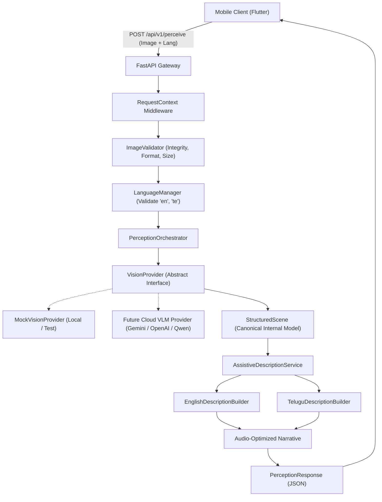

# Architecture Documentation

## Vision-Based Assistive Perception System with Voice Assistance for the Visually Impaired

### 1. Overview
The system enables visually impaired users to perceive environmental surroundings through smartphone cameras by delivering natural, audio-optimized spatial guidance in both English and Telugu.

---

### 2. Provider-Independent Perception Architecture

The backend implements a decoupled, vendor-agnostic pipeline so that switching between vision AI providers (e.g. Google Gemini 1.5 Flash, OpenAI GPT-4o-mini, Qwen2-VL, or open-source self-hosted VLMs) does not affect the mobile application contract or the localization layer.



---

### 3. Perception API Contract

#### Endpoint: `POST /api/v1/perceive`
* **Content-Type**: `multipart/form-data`
* **Request Parameters**:
  * `image` (*UploadFile*, required): Binary camera image file (`JPEG`, `PNG`, `WEBP`, max 15MB).
  * `language` (*string*, optional, default: `"en"`): Requested speech output language (`"en"` or `"te"`).
  * `client_metadata` (*string*, optional): Client-side device or sensor orientation hints.
  * `request_id` (*string*, optional): Unique client request identifier (auto-generated if omitted).

#### Success Response Schema (`200 OK`)
```json
{
  "request_id": "req-9b8a2c1f0d3e",
  "status": "success",
  "language": "en",
  "description": "There is a person standing in front of you. A chair is on your left side and a table is nearby.",
  "scene_data": {
    "objects": [
      {
        "label": "person",
        "position": "front",
        "distance": "near",
        "confidence": 0.95,
        "attributes": ["standing"],
        "interaction": "facing towards you",
        "is_obstacle": false
      },
      {
        "label": "chair",
        "position": "left",
        "distance": "near",
        "confidence": 0.91,
        "attributes": ["wooden", "office chair"],
        "interaction": null,
        "is_obstacle": false
      }
    ],
    "context": {
      "setting": "indoor room",
      "lighting": "well-lit",
      "hazards_or_obstacles": [],
      "observed_features": ["person", "chair", "table"],
      "inferred_context": ["indoor residential or office space"],
      "unavailable_information": ["exact distance to rear wall is unknown"]
    },
    "primary_focus": "person standing in front"
  },
  "processing_time_ms": 142.5,
  "warnings": [],
  "errors": null
}
```

---

### 4. Structured Scene Representation

The system internally represents environmental perception using `StructuredScene` models, maintaining a strict distinction between:
1. **Observed Features**: Grounded physical objects verified by visual features.
2. **Inferred Context**: Probabilistic context deductions (e.g., room type).
3. **Unavailable Information**: Explicitly marked data gaps (e.g. unknown distances or occluded views). Distance is never fabricated or guessed.

```python
class SpatialPosition(str, Enum):
    FRONT = "front"
    LEFT = "left"
    RIGHT = "right"
    CENTER = "center"
    SURROUNDING = "surrounding"
    UNKNOWN = "unknown"

class DistanceEstimate(str, Enum):
    NEAR = "near"         # 0 - 2 meters
    MEDIUM = "medium"     # 2 - 5 meters
    FAR = "far"           # > 5 meters
    UNKNOWN = "unknown"   # Cannot be reliably determined
```

---

### 5. Assistive Description Generation

Visual descriptions for visually impaired users must be concise and easily understood via auditory playback (target: 1–3 short sentences).

#### Prioritization Rules:
1. **Immediate Obstacles/Hazards**: Paths blocked by items or drops.
2. **Objects Directly in Front**: Primary focal objects facing the user.
3. **Left/Right Spatial Orientation**: Side obstacles or landmarks.
4. **Surrounding Setting**: General context.

#### Output Comparison:
* **English Output**:
  > *"There is a person standing in front of you. A chair is on your left side and a table is nearby."*
* **Telugu Output**:
  > *"మీ ముందు ఒక వ్యక్తి ఉన్నారు. మీ ఎడమ వైపున ఒక కుర్చీ ఉంది మరియు దగ్గరలో ఒక టేబుల్ ఉంది."*

---

### 6. Standardized Error Handling

API-level errors return client-safe JSON responses using `PerceptionErrorResponse` with machine-readable error codes:

| Error Code | HTTP Status | Trigger Condition |
| :--- | :--- | :--- |
| `MISSING_IMAGE` | 400 Bad Request | Request sent without an image file or with 0 bytes |
| `UNSUPPORTED_LANGUAGE` | 400 Bad Request | Requested language outside supported registry |
| `INVALID_IMAGE` | 422 Unprocessable Content | Corrupted bytes, unsupported formats, or undersized images |
| `IMAGE_TOO_LARGE` | 413 Payload Too Large | Image file exceeds 15 MB threshold |
| `PROVIDER_UNAVAILABLE`| 503 Service Unavailable | Underlying vision AI provider is unreachable |
| `PROCESSING_FAILURE` | 500 Internal Server Error | Unparseable or crashed vision analysis |
| `TIMEOUT` | 504 Gateway Timeout | Pipeline exceeded operational time threshold |

---

### 7. Performance & Latency Logging

The backend records structured performance logs per request without logging private user information or raw image bytes:
```
[PERF] RequestID=req-001 Endpoint=/api/v1/perceive Lang=en Provider=mock_provider Val=3.2ms Vision=12.1ms Desc=1.4ms Total=16.7ms Status=SUCCESS
```
This telemetry will be used in the evaluation phase to measure round-trip perception latency for the academic thesis.
